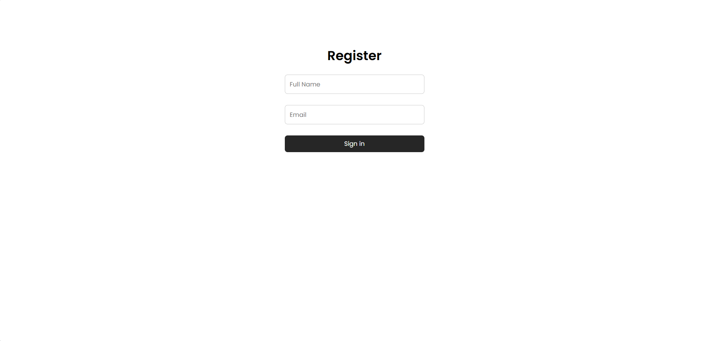
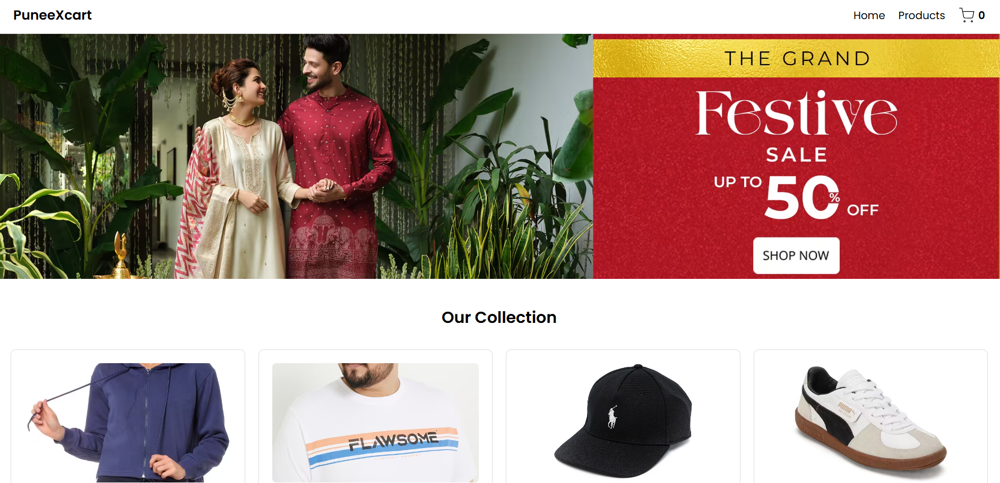
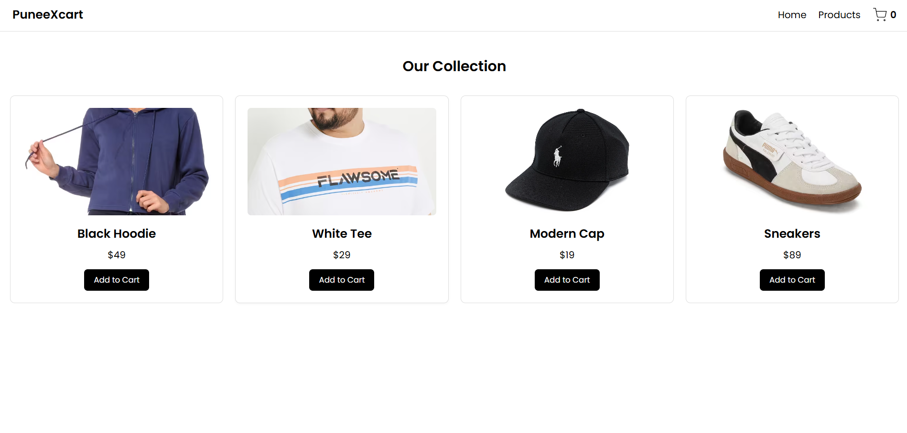
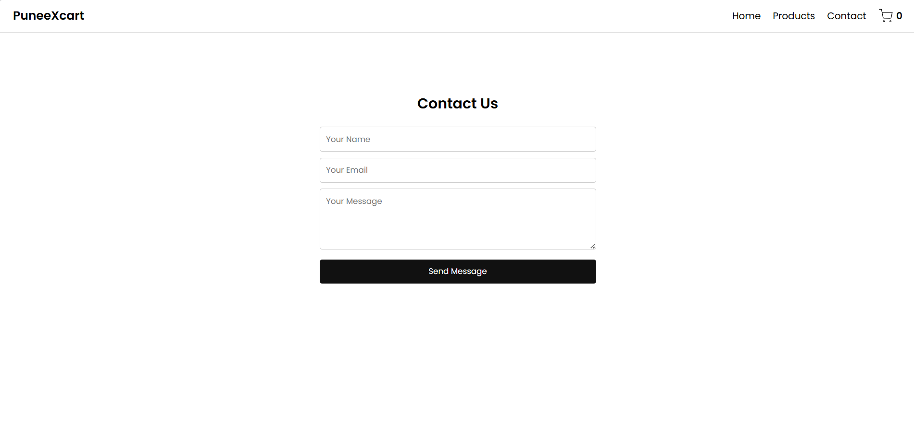

# 🛒 PuneeXcart

A modern, responsive e-commerce React application built with clean design principles and intuitive user experience.

## Preview






## ✨ Features

- **User Registration Systems** - Simple and secure user onboarding
- **Product Catalog** - Browse through a curated collection of products
- **Shopping Cart** - Real-time cart management with item counter
- **Contact Form** - Get in touch with customers through integrated contact system
- **Responsive Design** - Optimized for all device sizes
- **Modern UI/UX** - Clean, minimalist design with smooth transitions

## 🚀 Live Demo

Experience PuneeXcart in action with our interactive demo featuring:
- Black Hoodies
- White Tees  
- Modern Caps
- Sneakers

## 🛠️ Tech Stack

- **Frontend Framework:** React 18
- **Routing:** React Router DOM
- **Styling:** Pure CSS with modern design patterns
- **State Management:** React Hooks (useState)
- **Font:** Poppins (Google Fonts)

## 📱 Pages & Components

### Pages
- **Home** - Hero section with festive background and product showcase
- **Products** - Grid-based product catalog with add-to-cart functionality
- **Contact** - Form-based contact system with validation
- **Register** - User registration and authentication

### Components  
- **Navbar** - Navigation with cart counter and responsive design
- **Footer** - Clean footer with branding information

## 🎨 Design Highlights

- **Color Scheme:** Clean black and white with accent colors
- **Typography:** Poppins font family for modern readability
- **Layout:** CSS Grid and Flexbox for responsive design
- **Interactions:** Smooth hover effects and transitions
- **Visual Elements:** Product images from premium sources

## 🚦 Getting Started

### Prerequisites
- Node.js (v14 or higher)
- npm or yarn package manager

### Installation

1. **Clone the repository**
   ```bash
   git clone https://github.com/Mahadevaprasad17/puneexcart.git
   cd puneexcart
   ```

2. **Install dependencies**
   ```bash
   npm install
   ```

3. **Start the development server**
   ```bash
   npm start
   ```

4. **Open your browser**
   Navigate to `http://localhost:3000`

### Required Dependencies

```json
{
  "react": "^18.0.0",
  "react-dom": "^18.0.0",
  "react-router-dom": "^6.0.0"
}
```

## 📁 Project Structure

```
puneexcart/
├── public/
├── src/
│   ├── components/
│   │   ├── Navbar.jsx
│   │   └── Footer.jsx
│   ├── pages/
│   │   ├── Home.jsx
│   │   ├── Products.jsx
│   │   ├── Contact.jsx
│   │   └── Register.jsx
│   ├── App.jsx
│   ├── App.css
│   └── index.js
├── package.json
└── README.md
```

## 🔧 Key Functionalities

### Authentication Flow
- Users must register before accessing the main application
- Simple name and email registration process
- Automatic redirect to home page after successful registration

### Shopping Experience
- Product grid with high-quality images
- Add to cart functionality with real-time counter updates
- Responsive product cards with hover effects

### Contact System  
- Form validation for required fields
- Success feedback with alert system
- Auto-clearing form after submission

## 🎯 Usage Examples

### Adding Products to Cart
```javascript
const addToCart = (item) => setCart([...cart, item]);
```

### User Registration
```javascript
const handleRegister = (userData) => {
  setUser(userData);
  // Redirects to main application
};
```

### Contact Form Submission
```javascript
const handleSubmit = (e) => {
  e.preventDefault();
  alert(`Message sent by ${name} (${email}): ${message}`);
  // Form auto-clears
};
```

## 🎨 Customization

### Styling
- Modify `App.css` for global styles
- Update color scheme by changing CSS custom properties
- Adjust grid layouts in `.grid4` class for different product arrangements

### Product Catalog
- Update the `items` array in `Products.jsx` to add/modify products
- Change product images by updating the `img` property
- Adjust pricing in the `price` field

### Branding
- Update logo text in `Navbar.jsx`
- Modify footer copyright in `Footer.jsx`
- Change hero background image URL in `Home.jsx`

<div align="center">
  <strong>Built with using React</strong>
  <br />
  <sub>Making shopping experiences delightful, one click at a time.</sub>
</div>